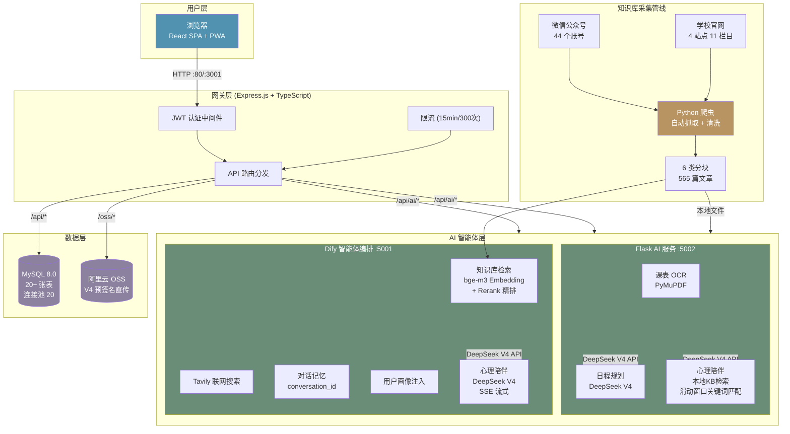
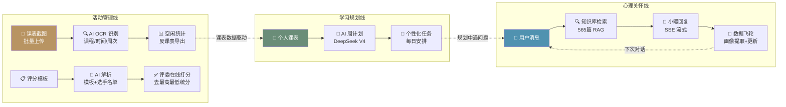
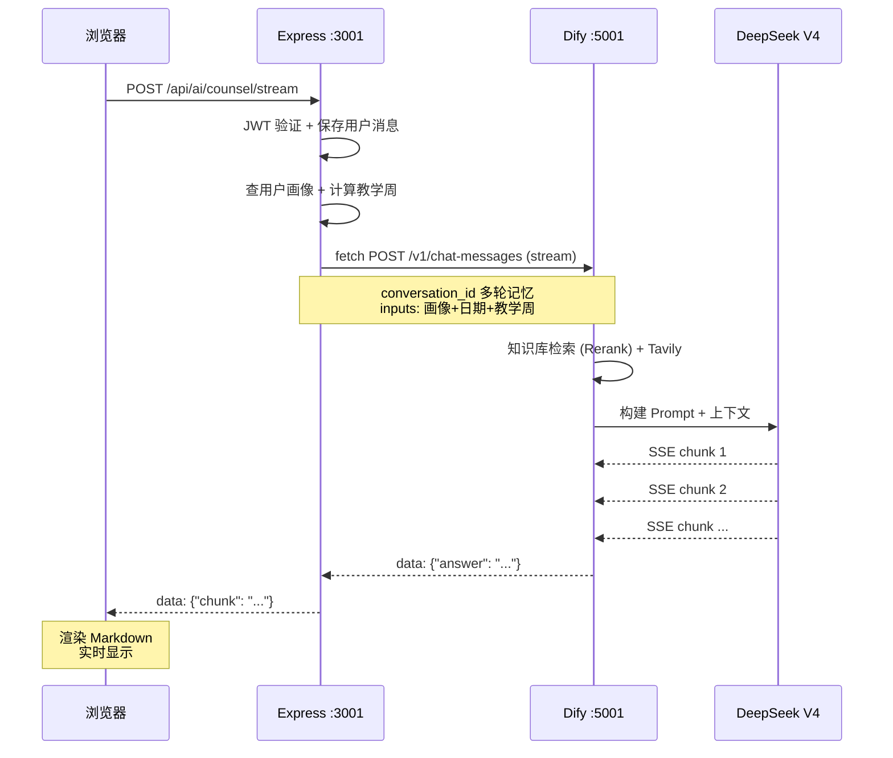
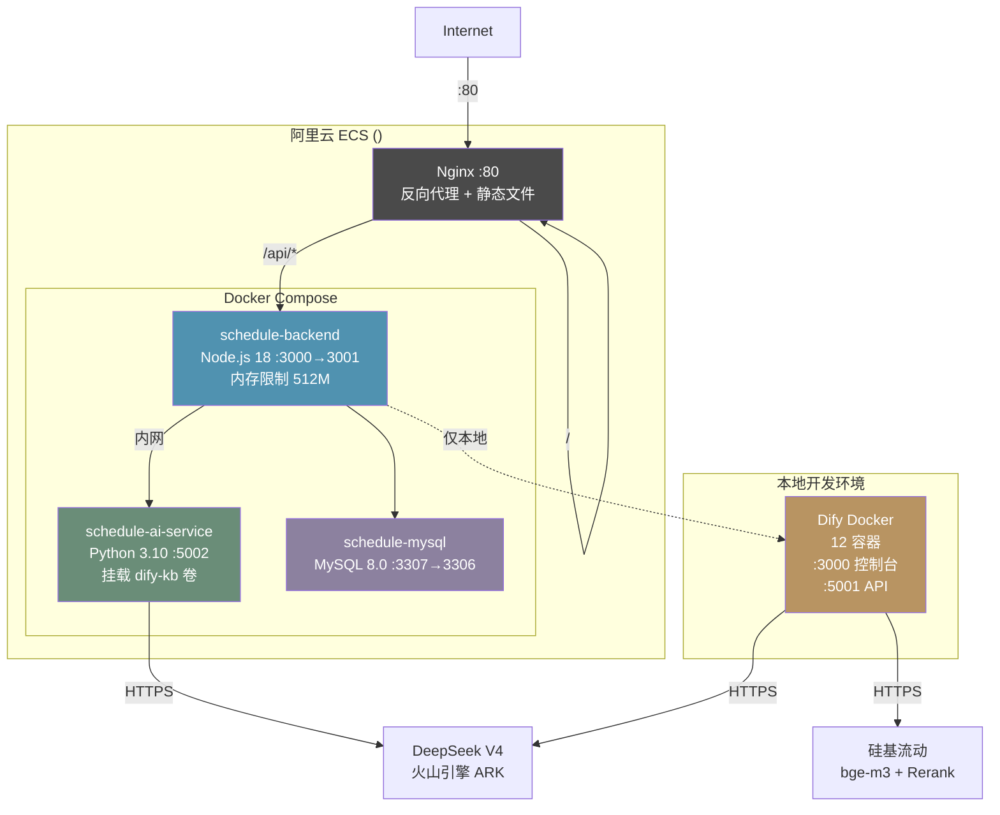
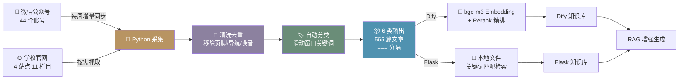

# 系统架构图

## 全景架构

```mermaid
graph TB
    subgraph 用户层["用户层"]
        Browser["浏览器<br/>React SPA + PWA"]
    end

    subgraph 网关层["网关层 (Express.js + TypeScript)"]
        Auth["JWT 认证中间件"]
        Router["API 路由分发"]
        RateLimit["限流 (15min/300次)"]
    end

    subgraph AI层["AI 智能体层"]
        direction LR
        subgraph Flask["Flask AI 服务 :5002"]
            OCR["课表 OCR<br/>PyMuPDF"]
            Schedule["日程规划<br/>DeepSeek V4"]
            Counsel_F["心理陪伴<br/>本地KB检索<br/>滑动窗口关键词匹配"]
        end
        subgraph Dify["Dify 智能体编排 :5001"]
            KB["知识库检索<br/>bge-m3 Embedding<br/>+ Rerank 精排"]
            Tavily["Tavily 联网搜索"]
            Memory["对话记忆<br/>conversation_id"]
            Profile["用户画像注入"]
            Counsel_D["心理陪伴<br/>DeepSeek V4<br/>SSE 流式"]
        end
    end

    subgraph 数据层["数据层"]
        MySQL[("MySQL 8.0<br/>20+ 张表<br/>连接池 20")]
        OSS[("阿里云 OSS<br/>V4 预签名直传")]
    end

    subgraph 知识库管道["知识库采集管线"]
        WeChat["微信公众号<br/>44 个账号"]
        Website["学校官网<br/>4 站点 11 栏目"]
        Crawler["Python 爬虫<br/>自动抓取 + 清洗"]
        Chunk["6 类分块<br/>565 篇文章"]
    end

    Browser -->|"HTTP :80/:3001"| Auth
    Auth --> Router
    Router -->|"/api/ai/*"| Flask
    Router -->|"/api/ai/*"| Dify
    Router -->|"/api/*"| MySQL
    Router -->|"/oss/*"| OSS
    RateLimit --> Router

    WeChat --> Crawler
    Website --> Crawler
    Crawler --> Chunk
    Chunk --> KB
    Chunk -->|"本地文件"| Flask

    Dify -->|"DeepSeek V4 API<br/>火山引擎 ARK"| Counsel_D
    Flask -->|"DeepSeek V4 API<br/>火山引擎 ARK"| Schedule
    Flask -->|"DeepSeek V4 API"| Counsel_F

    style Browser fill:#5092b0,color:#fff
    style Flask fill:#6a8d78,color:#fff
    style Dify fill:#6a8d78,color:#fff
    style MySQL fill:#8c819f,color:#fff
    style OSS fill:#8c819f,color:#fff
    style Crawler fill:#b89462,color:#fff
```

## 三条智能线数据流

```mermaid
flowchart LR
    subgraph 活动管理线
        A1["📸 课表截图<br/>批量上传"] --> A2["🔍 AI OCR 识别<br/>课程/时间/周次"]
        A2 --> A3["📊 空闲统计<br/>反课表导出"]
        A4["📋 评分模板"] --> A5["🤖 AI 解析<br/>模板+选手名单"]
        A5 --> A6["✅ 评委在线打分<br/>去最高最低统分"]
    end

    subgraph 学习规划线
        B1["📅 个人课表"] --> B2["🎯 AI 周计划<br/>DeepSeek V4"]
        B2 --> B3["📝 个性化任务<br/>每日安排"]
    end

    subgraph 心理关怀线
        C1["💬 用户消息"] --> C2["🔍 知识库检索<br/>565篇 RAG"]
        C2 --> C3["🤖 小暖回复<br/>SSE 流式"]
        C3 --> C4["🔄 数据飞轮<br/>画像提取+更新"]
        C4 -.->|"下次对话"| C1
    end

    A3 -.->|"课表数据驱动"| B1
    B3 -.->|"规划中遇问题"| C1

    style A1 fill:#b89462,color:#fff
    style B1 fill:#6a8d78,color:#fff
    style C1 fill:#5092b0,color:#fff
```

## SSE 流式输出链路

```mermaid
sequenceDiagram
    participant B as 浏览器
    participant E as Express :3001
    participant D as Dify :5001
    participant AI as DeepSeek V4

    B->>E: POST /api/ai/counsel/stream
    E->>E: JWT 验证 + 保存用户消息
    E->>E: 查用户画像 + 计算教学周
    E->>D: fetch POST /v1/chat-messages (stream)
    Note over E,D: conversation_id 多轮记忆<br/>inputs: 画像+日期+教学周
    D->>D: 知识库检索 (Rerank) + Tavily
    D->>AI: 构建 Prompt + 上下文
    AI-->>D: SSE chunk 1
    AI-->>D: SSE chunk 2
    AI-->>D: SSE chunk ...
    D-->>E: data: {"answer": "..."}
    E-->>B: data: {"chunk": "..."}
    Note over B: 渲染 Markdown<br/>实时显示
```

## 部署架构

```mermaid
graph TB
    subgraph 阿里云ECS["阿里云 ECS (<server-ip>)"]
        Nginx["Nginx :80<br/>反向代理 + 静态文件"]
        subgraph Docker["Docker Compose"]
            Backend["schedule-backend<br/>Node.js 18 :3000→3001<br/>内存限制 512M"]
            AIService["schedule-ai-service<br/>Python 3.10 :5002<br/>挂载 dify-kb 卷"]
            MySQL_D["schedule-mysql<br/>MySQL 8.0 :3307→3306"]
        end
    end

    subgraph 本地["本地开发环境"]
        DifyLocal["Dify Docker<br/>12 容器<br/>:3000 控制台<br/>:5001 API"]
    end

    Internet -->|":80"| Nginx
    Nginx -->|"/api/*"| Backend
    Nginx -->|"/"| Nginx
    Backend -->|"内网"| AIService
    Backend --> MySQL_D
    Backend -.->|"仅本地"| DifyLocal

    AIService -->|"HTTPS"| DeepSeek["DeepSeek V4<br/>火山引擎 ARK"]
    DifyLocal -->|"HTTPS"| DeepSeek
    DifyLocal -->|"HTTPS"| SiliconFlow["硅基流动<br/>bge-m3 + Rerank"]

    style Nginx fill:#4a4a4a,color:#fff
    style Backend fill:#5092b0,color:#fff
    style AIService fill:#6a8d78,color:#fff
    style MySQL_D fill:#8c819f,color:#fff
    style DifyLocal fill:#b89462,color:#fff
```

## 知识库管线

```mermaid
flowchart LR
    WX["📱 微信公众号<br/>44 个账号"] -->|"每周增量同步"| Crawl["🐍 Python 采集"]
    Web["🌐 学校官网<br/>4 站点 11 栏目"] -->|"按需抓取"| Crawl

    Crawl --> Clean["🧹 清洗去重<br/>移除页脚/导航/噪音"]
    Clean --> Class["🏷️ 自动分类<br/>滑动窗口关键词"]
    Class --> Store["📦 6 类输出<br/>565 篇文章<br/>=== 分隔"]

    Store -->|"Dify"| Vector["🔢 bge-m3 Embedding<br/>+ Rerank 精排"]
    Store -->|"Flask"| Local["📄 本地文件<br/>关键词匹配检索"]

    Vector --> KB_D["Dify 知识库"]
    Local --> KB_F["Flask 知识库"]
    KB_D --> RAG["RAG 增强生成"]
    KB_F --> RAG

    style Crawl fill:#b89462,color:#fff
    style Clean fill:#8c819f,color:#fff
    style Class fill:#6a8d78,color:#fff
    style Store fill:#5092b0,color:#fff
```
